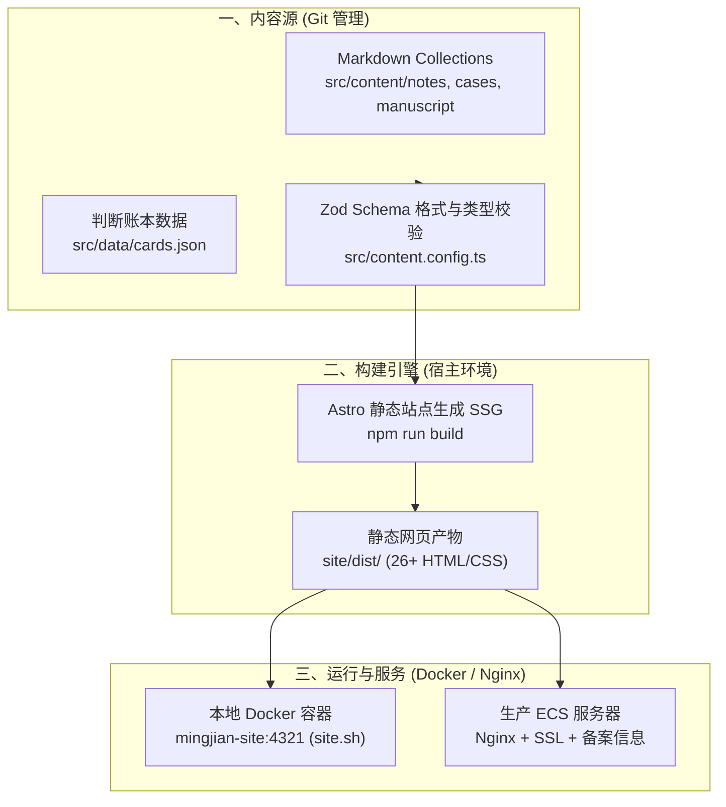

# 明鉴官网 V2 · 全套架构说明与操作写作指南

> 适用版本：**明鉴官网 V2（Astro + Git-based Content + Docker）**  
> 生产域名：`https://tommywang.cn` | 本地预览：`http://localhost:4321` | 写作工作台：`http://localhost:4321/admin/`  
> 远端仓库：`git@github.com:tommy-wangbot/tommywang.cn.git`  
> 最后更新：2026-08-16

---

## 🏛️ 第一部分：明鉴官网 V2 系统架构全景

### 1. 核心定位与设计哲学
* **定位**：王少怀（Tommy）的个人知识网络、公开编制手稿与外部交流的统一承载底座。
* **核心哲学（不可篡改的认知账本）**：
  * **改判只追加，不删改**：所有的研判、下注、失误与复核全部公开留痕；
  * **Git 即数据库（Git-based Architecture）**：全站坚决不使用动态数据库与复杂后端，依赖 Git 的不可伪造时间戳与 Commit Diff 作为“个人认知资产”的公信力凭证。

---

### 2. 系统技术栈架构（Tech Stack）



* **构建核心**：**Astro (SSG 纯静态模式)** —— 高性能、零运行时 JS 负担、SEO 极佳。
* **数据校验**：**Zod + Astro Content Collections** —— 严格校验每篇笔记与文章的 YAML 元数据（状态、分类、日期、配对卡号）。
* **容器化与部署**：**Docker + Compose (`site.sh`)** —— 本地常驻容器预览，镜像离线构建，隔离宿主环境。

---

### 3. 全站内容体系四大分层

| 层级 | 对应路由 | 承载内容与职责 | 数据源文件 |
| :--- | :--- | :--- | :--- |
| **一、工作方法** | `/method/` | 四步法（提纯、证据链、判断卡、预演）+ 星澜等实战咨询案例 | `src/content/cases/*.md`<br>`src/pages/method/` |
| **二、公开著作** | `/research/cognitive-capital/` | 《认知资本论》三条公理、五部脉络与**公开编制手稿** | 全书底稿：`~/Documents/明鉴官网/核心模块二：认知资本论/认知资本论：AI时代的新生产关系与人类价值重置V2.md`<br>网站按部切分：`src/content/manuscript/*.md`<br>`src/content/excerpts/*.md` |
| **三、判断账本** | `/research/ledger/` | 5 张 JUG 核心判断卡（置信度、失效条件、复核历史）+ 假设层 + 问题层 | `src/data/cards.json`<br>`src/data/ledger.ts` |
| **四、研判笔记** | `/notes/` | 弱信号捕捉、日常研判短记、尚未成卡的问题与假设 | `src/content/notes/*.md` |
| **— 配对卡块** | 文章页首（无独立路由） | 文章与判断卡的对应关系：页首「本文对应的判断卡」区块 + 页脚「账本状态」（用法见 [场景 C](#4-场景-c给文章挂配对卡)） | 文章的 `cardId` / `cardIds` ＋ `src/data/cards.json` |
| **管理后台** | `/admin/` | **纯前端写作编制工作台**（生成标准 Markdown 与卡片 JSON） | `src/pages/admin/index.astro` |

---

### 4. 目录结构与代码映射

```text
build-v2/
├── .gitignore                   # 忽略临时备份与本地脚本
├── 操作与写作指南.md             # 本架构与操作说明文档
├── content/                     # 原始内容草稿
└── site/                        # Astro 网站工程根目录
    ├── Dockerfile               # 离线运行容器镜像定义
    ├── compose.yaml             # 本地常驻服务编排
    ├── site.sh                  # 容器运维一键脚本 (start/stop/rebuild)
    ├── package.json             # 依赖配置
    ├── public/                  # 静态公共资源 (图标、公安网安标等)
    ├── dist/                    # 静态生成产物目录 (构建输出)
    └── src/
        ├── content.config.ts    # 核心：定义 notes/cases/manuscript 的 Zod 校验规则
        ├── content/             # Markdown 内容集合源文件
        │   ├── notes/           # 研判笔记与长文
        │   ├── cases/           # 咨询与方法案例
        │   └── manuscript/      # 《认知资本论》各部手稿
        ├── data/                # 结构化数据
        │   ├── cards.json       # 公开判断卡核心数据 (JUG-TW-...)
        │   ├── cards.ts         # 卡片数据加载与变动派生逻辑
        │   └── ledger.ts        # 账本假设层/问题层与三层关系定义
        ├── pages/               # 路由页面 (index, research, method, notes, admin)
        ├── components/          # UI 组件 (LedgerCard, StatusTag, SiteHeader 等)
        └── layouts/             # 页面母版 (BaseLayout.astro)
```

---

## ⚡ 第二部分：一分钟日常速查卡

### 1. 接到补丁脚本（如 `applyX.sh`）怎么跑？
```bash
cd ~/Documents/明鉴官网/build-v2/site
chmod +x apply5.sh && ./apply5.sh
npm run build && ./site.sh rebuild
```

### 2. 本地改完，推送到 GitHub 远端
```bash
cd ~/Documents/明鉴官网/build-v2
git add .
git commit -m "feat: 更新内容"
git push origin main
```

### 3. 本地站点容器管理
```bash
cd ~/Documents/明鉴官网/build-v2/site
./site.sh start      # 启动本地容器 (http://localhost:4321)
./site.sh stop       # 停止本地容器
./site.sh rebuild    # 修改代码或构建后，重启并应用新镜像
```

---

## 🛠️ 第三部分：补丁脚本与站点全套重建 SOP

当大模型提供了 `applyX.sh` 等更新脚本时，按以下标准闭环流程操作：

### 步骤 1：放入目录并赋予权限
将脚本文件放入 `build-v2/site/` 目录下。若终端报错 `zsh: permission denied`，是因为脚本缺少可执行权限。
运行以下命令一次性授权并执行：
```bash
cd ~/Documents/明鉴官网/build-v2/site
chmod +x apply5.sh && ./apply5.sh
```
> *注：脚本会自动将旧版文件备份到 `site/.backup-v2*-时间戳/` 目录。*

### 步骤 2：本地静态编译与容器刷新
每次执行完脚本或手动改动了 Markdown / TS 代码后，**必须执行编译和容器重建**，否则浏览器看到的依然是旧容器缓存：
```bash
npm run build && ./site.sh rebuild
```
* `npm run build`：Astro 编译 26 个静态页面到 `dist/`。
* `./site.sh rebuild`：将最新静态产物打包进 Docker 镜像并重启本地常驻容器。

### 步骤 3：浏览器强制刷新检验
打开 `http://localhost:4321`，按键盘快捷键：
* **`Cmd + Shift + R`**（强制清缓存刷新）

### 步骤 4：同步推送到 GitHub
确认本地无误后，提交并推送到 GitHub 远端：
```bash
cd ~/Documents/明鉴官网/build-v2
git add .
git commit -m "feat(v2): 应用 apply5 更新"
git push origin main
```

---

## ✍️ 第四部分：写作编制工作台（`/admin/`）实操指南

为了既保留“网页可视化填表”的便利，又坚守“改判只追加、不删改、全留 Git 历史”的公信力原则，系统内置了纯前端的**浅色写作工作台**。

### 1. 如何打开？
在浏览器直接访问：👉 **[http://localhost:4321/admin/](http://localhost:4321/admin/)**  
*(为保护私密性，未在全站公共导航栏挂出，直接输网址即可打开)*

---

### 2. 场景 A：新建「研判笔记 / 文章」
适合记录行业微观信号、日常研判、或长篇推导文章。


#### 填写要点：
1. **标题**：如 `AI 替代执行层对中国分配体系的传导机制`；
2. **文件名 / 网址段 (Slug)**：英文小写+连字符，如 `ai-distribution-impact`；
3. **状态（单选）**：
   * `问题`：还没有答案的真问题；
   * `假设`：有因果解释，但证据链尚不完全；
   * `判断`：已能清晰写出反证信号与失效条件。
4. **栏目（单选）**：
   * `笔记`：弱信号/短记，挂在 `/notes/`；
   * `文章`：长文推导，挂在 `/research/`。
5. **关联判断卡编号 (可选)**：如已在账本立卡，填入 `JUG-TW-20260809-02`。**一篇文章可以挂多张卡**——写作台只有一个输入框，多卡时下载文件后在 frontmatter 改成 `cardIds` 数组，站点会自动在正文开头生成「配对卡块」。规则见 [§4](#4-场景-c给文章挂配对卡)。
6. **一句话摘要**：用于列表页的导读展示。
7. **正文**：直接使用 Markdown 书写。

#### 产物归档：
* 点击 **「💾 下载文件」**，将生成的 `.md` 文件移动到：  
  `~/Documents/明鉴官网/build-v2/site/src/content/notes/`

> ⚠️ **frontmatter 字段由 `content.config.ts` 校验，缺字段或写错枚举会导致构建失败。** 最常漏的是 `kind`（`文章` / `笔记`）和 `draft`（`true` 表示不发布）。

---

### 3. 场景 B：编制「判断卡 (Judgment Card)」
适合将成熟的观点正式录入公开判断账本。

#### 填写要点（严谨性约束）：
1. **卡片编号**：严格遵循 `JUG-[TW/ME]-[8位日期]-[2位序号]`，例如 `JUG-TW-20260816-01`。
2. **领域 / 命题**：如 `中国宏观 × AI 对就业与分配制度的传导`。
3. **当前下注 (Judgment)**：明确你的核心判断，禁用模棱两可的模糊词。
4. **置信度**：`0.0 ~ 1.0` 之间的单个小数（如 `0.60`）。
5. **最脆弱假设**：这套判断最依赖但目前最缺乏证据的一环。
6. **反向压力测试**：站在反方视角最强有力的反驳是什么。
7. **失效触发器 (Falsifier)**：**必填**！必须清晰列出“发生什么事实就算我错了”（每行一条）。**缺失效条件时表单会拒绝生成**。

#### 产物归档：
* 点击 **「生成卡片 JSON」** ➔ 点击 **「📋 复制卡片 JSON」**；
* 打开文件：`~/Documents/明鉴官网/build-v2/site/src/data/cards.json`；
* 粘贴进 `cards` 数组列表里保存即可。

---

### 4. 场景 C：给文章挂「配对卡」

「配对卡」是文章与判断卡之间的那条线：**页首**标明这篇文章对应哪几张卡，**页脚**标明账本状态。它不是手写的正文，而是由 frontmatter 自动生成——写对卡号，块就出现。

#### 4.1 frontmatter 两种写法

```yaml
# 挂一张卡（写作台生成的默认形式）
cardId: JUG-TW-20260815-02

# 挂多张卡：写作台只给一个输入框，多卡时下载后手工改成数组
cardIds:
  - JUG-TW-20260815-02
  - JUG-TW-20260815-04
```

两种可以并存（`cardId` 在前、`cardIds` 在后，渲染时合并去重）。**卡号必须在 `cards.json` 里存在**；写错的卡号不会报错，但会以「未公开」形式出现（见下）。

#### 4.2 卡号的三种去向：按卡的登记信息决定，不靠卡号猜

| 卡的类型 | 判定依据 | 页首块的链接去向 | 页面上的样子 |
| :--- | :--- | :--- | :--- |
| **公开卡** | 在 `cards.json` 中且未标 `offLedger` | `/research/ledger/#card-<卡号>` | 卡标题（可点）＋ 卡号 |
| **案例卡** | 标了 `offLedger: true`（如星澜 `CS-XINGLAN-01`） | 卡片自己的 `link.href`，一般指向项目案例页 | 卡标题（可点）＋ 卡号 ＋`案例卡` 标签 |
| **草稿 / 未登记卡** | `cards.json` 里找不到，或卡片尚未公开 | 不给链接 | 卡号（灰）＋`未公开` 标签 |

标题栏会如实统计，例如「本文对应的判断卡 · 2 张」「· 1 张（0 张已公开）」。

#### 4.3 生效范围与相关文件

改一处，两处自动跟着变——**不需要逐篇手写，也不要在正文里手打卡号链接**：

* 页首块：`src/components/CardPair.astro`，由 `src/pages/notes/[...slug].astro` 注入到正文最前面；
* 页脚账本状态：同一个页脚模板，按"有没有公开卡"分三种文案；
* 列表页显示：`/notes/` 与 `/research/` 的条目右侧同样显示配对卡；
* 卡号解析：`src/lib/notes.ts` 的 `cardIdsOf()`（合并 `cardId` 与 `cardIds`）与 `cardTitle()`（取卡标题）。

#### 4.4 自查清单（发稿前）

1. 卡号真的在 `cards.json` 里？→ `grep "卡号" src/data/cards.json`
2. 案例卡要给链接，卡上得有 `link.href`；没有就会显示成"未公开"；
3. 改完跑一次构建，构建产物里能查到区块才算生效：
   ```bash
   cd ~/Documents/明鉴官网/build-v2/site
   npm run build && grep -c 'class="cards-pair"' dist/notes/<slug>/index.html
   ```
4. 忘了编号格式：判断卡是 `JUG-TW-YYYYMMDD-NN`（`JUG-ME-` 为他人卡），案例卡是 `CS-项目-序号`。

---

## 🔍 第五部分：常见问题排错清单

### Q1: 运行脚本报 `zsh: permission denied`？
* **原因**：新脚本未赋予执行权限。
* **解决**：运行 `chmod +x 脚本名.sh && ./脚本名.sh`。

### Q2: 为什么改了文件，浏览器看到的还是旧内容？
* **排查 1**：没有重新编译 Docker 镜像。运行 `npm run build && ./site.sh rebuild`。
* **排查 2**：浏览器缓存。在网页中按 `Cmd + Shift + R` 强制刷新。

### Q3: 写作台生成的 Markdown 文件放在哪生效？
* 笔记/文章放在：`build-v2/site/src/content/notes/<文件名>.md`
* 案例放在：`build-v2/site/src/content/cases/<文件名>.md`
* 手稿放在：`build-v2/site/src/content/manuscript/<文件名>.md`
* 手稿全书底稿在：`~/Documents/明鉴官网/核心模块二：认知资本论/认知资本论：AI时代的新生产关系与人类价值重置V2.md`（网站各部从这里切，别在仓库外另找一份）

### Q4: 发布新内容后如何推送给百度搜索？
* 运行：`~/Documents/明鉴官网/build-v2/push_baidu.sh`
* 脚本会自动从生成的 Sitemap 中提取全量 URL 并智能按当日配额分批推送。
* 每天凌晨 00:05 本机已配置自动推送任务，无需频繁手动执行。

### Q5: 文章页首没有出现「配对卡」块，或者卡片显示成「未公开」？
* **没有块**：frontmatter 里没写 `cardId` / `cardIds`。补上卡号，重新构建即可（块是自动生成的，不用手写）。
* **显示「未公开」**：卡号在 `src/data/cards.json` 里找不到——多半是卡号打错（注意是 `JUG-TW-` 还是 `JUG-ME-`、日期是 8 位），或者这张卡还没登记。案例卡另外要确认卡上有 `link.href`，否则没有链接可点。
* **对照自检**：`grep -c 'class="cards-pair"' dist/notes/<slug>/index.html`，返回 `1` 才算生效。详见 [场景 C](#4-场景-c给文章挂配对卡)。
